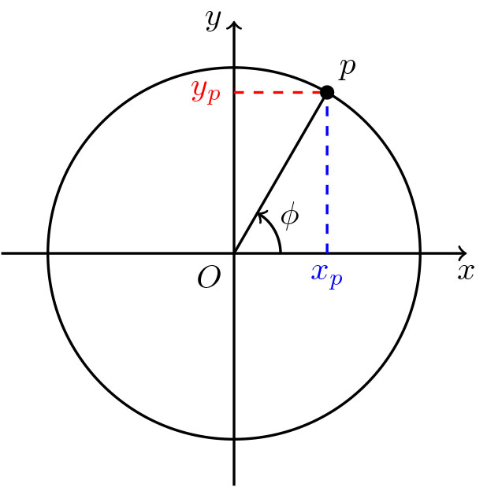
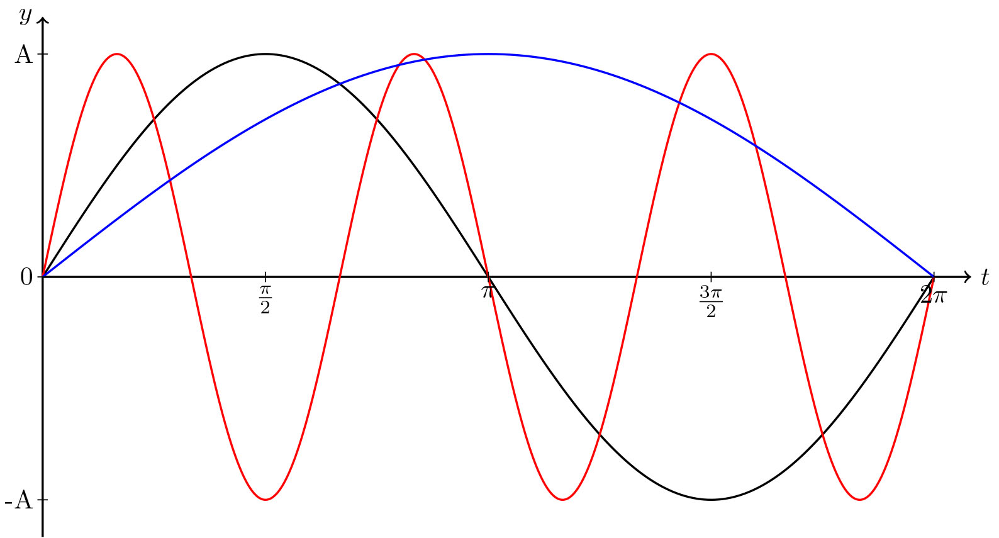

# Pengenalan Kepada Fungsi Gelombang

Dalam mekanik kuantum, kita akan selalu bertemu dengan fungsi gelombang berbentuk eksponen. Khususnya, eksponen berkuasa khayalan, $e^{i\phi}$. Agak hairan bagaimana fungsi eksponen yang lazimnya berbentuk penokokan atau penyusutan mendadak boleh mempunyai bentuk gelombang yang naik dan turun secara berkala. Bab ini akan cuba merungkai bagaimana fungsi eksponen berkuasa khayalan boleh mempunyai bentuk gelombang melalui fungsi sinus dan kosinus.

## Bulatan Unit: Fungsi Trigonometri

Bagi membina jambatan dari fungsi sinus ke fungsi eksponen, kita perlu melihatnya dari sudut pandang geometri. Lagipun, fungsi sinus memang berasal dari ilmu geometri sebab itulah ia termasuk dalam fungsi-fungsi trigonometri. Mari kita bina bulatan unit.

Perkataan 'unit' dalam istilah 'bulatan unit' merujuk kepada nilai 'satu'. Bulatan unit merujuk kepada sejenis bulatan yang mempunyai jejari satu yang dilukis pada satah Kartes. Boleh sahaja kita pilih mana-mana jejari lain tetapi jejari satu ditetapkan sebagai rujukan. 

Sememangnya, nilai satu digunakan sebagai rujukan untuk mana-mana ukuran pun. Misalnya, ukuran panjang pada pembaris ditandakan setiap kali tiba kepanjangan 'satu' meter atau 'satu' sentimeter, dsb. Hal ini yang melayakkan ia memegang nama 'unit'.

```{r fg-bulat-unit, echo=FALSE, fig.align='center',out.width='300px', fig.cap="Bulatan unit ialah bulatan berjejari 1."}

```

Terdapat dua kaedah untuk memerihalkan kedudukan setiap titik pada ukurlilit bulatan unit ini. Disebabkan bulatan ini dibentangkan pada satah Kartes, maka pastinya titik-titik itu boleh diperihalkan menggunakan koordinat Kartes $x_p$ dan $y_p$. Itulah kaedah pertamanya.

Kaedah keduanya ialah dengan menggunakan sudut $\phi$ yang memisahkan arah titik $p$ dengan arah positif paksi--$x$. Disebabkan titik-titik ini hanya berada pada garis ukurlilit itu sahaja, maka setiap sudut $\phi$ hanya akan dipasangkan pada satu satu titik $p$. Tidak ada titik lain yang akan berkongsi sudut tersebut.

Sebetulnya, untuk titik sembarangan pada satah Kartes, kaedah sudutan ini perlu dipasangkan dengan jaraknya dari asalan bagi membezakan titik yang berhampiran daripada titik yang berjauhan. Namun, disebabkan semua titik $p$ pada ukurlilit bulatan mempunyai jarak yang sama dari asalan, maka parameter jarak ini boleh diabaikan.

Disebabkan kedua-dua kaedah ini merujuk kepada perkara yang sama, wujudnya satu kesepadanan yang memadankan kaedah sudutan dengan kaedah koordinat Kartes. Dalam erti kata lain, terdapat fungsi yang boleh menterjemahkan sudut $\phi$ menjadi sesaran $x_p$ dan sesaran $y_p$,
$$f(\phi) \longrightarrow x_p,$$
$$g(\phi) \longrightarrow y_p.$$


```{r fg-sinus-kosinus, echo=FALSE, fig.align='center',out.width='500px', fig.cap="Graf yang dihasilkan oleh fungsi $f(\\phi)$ dan $g(\\phi)$ terhadap $\\phi$. Graf ini membentuk gelombang sinus."}
knitr::include_graphics('./gambar/fungsi/graf-bulatan-unit.jpg')
```

Kedua-dua graf ini mempunyai bentuk yang sama tetapi bermula di titik yang berbeza. Oleh itu, kedua-dua graf ini berkongsi nama yang sama, iaitu graf gelombang sinus. Fungsi yang **memetakan $\phi$ terhadap sesaran menaik $y_p$ ialah fungsi sinus** manakala fungsi yang **memetakan $\phi$ terhadap sesaran mengufuk $x_p$ ialah fungsi kosinus**^[Kosinus ialah pasangan kepada sinus, daripada imbuhan *co-* dalam bahasa Inggeris yang bermaksud bersama-sama atau pelengkap.],
\begin{align*}
\sin{(\phi)} &= y_p, (\#eq:fg-00)\\
\cos{(\phi)} &= x_p. (\#eq:fg-01)
\end{align*}

Hakikat ini penting untuk kita faham, iaitu apa makna sinus dan kosinus, lebih-lebih lagi jika kita ingin faham kaitan fungsi gelombang ini dengan fungsi gelombang dalam bentuk eksponen. Namun, sebelum kita bergerak ke fungsi eksponen, kita akan teroka sifat-sifat gelombang menggunakan fungsi trigonometri.

## Sifat Gelombang
Gelombang ialah suatu lengkung berkala. Ada dua nilai yang mencirikan sifat gelombang yang berkala ini, iaitu frekuensinya dan vektor gelombangnya. Frekuensi mengaitkan kitaran dalam dimensi masa manakala vektor gelombang mengaitkan kitaran dalam dimensi ruang.

### Kalaan dan Frekuensi
Kalaan ialah tempoh masa yang diambil oleh gelombang untuk melengkapkan satu kitaran. Ia disimbolkan menggunakan huruf $T$. Ia berkadaran songsang dengan kuantiti yang dinamakan frekuensi $f$ yang membawa makna jumlah kitaran dalam satu saat,
\begin{equation}
f = \frac{1}{T}.
\end{equation}
Apabila kita piawaikan satu kitaran untuk sentiasa membawa makna $2\pi$ radian, maka frekuensi yang didukung ialah frekuensi sudutan, $\omega$,
\begin{equation}
\omega = \frac{2\pi}{T} = 2\pi f.
(\#eq:fg-02)
\end{equation}

Gelombang yang mempunyai frekuensi tertentu merupakan suatu fungsi masa,
\begin{equation}
\Psi(t) = \sin{(\omega t)}.
(\#eq:fg-03)
\end{equation}
Frekuensi ialah suatu pemalar kerana kalaan $T$ ialah malar. Oleh itu, fungsi \@ref(eq:fg-03) hanyalah bergantung kepada masa sahaja.

Lebih tinggi frekuensi, lebih cepatlah ia melengkapkan satu kitaran maka lagi bertenagalah sistem tersebut. Natijahnya, tenaga sistem tersebut dikaitkan dengan frekuensi sistem tersebut. Itulah yang dilakukan oleh Planck seperti dalam bab \@ref(malapetaka-ultralembayung),
\begin{equation}
E = hf = \hbar\omega,
(\#eq:fg-04)
\end{equation}
dengan maksud $\hbar = \frac{h}{2\pi}$

```{r fg-frekuensi, echo=FALSE, out.width='400px', fig.cap="Gelombang sinus dengan frekuensi yang berbeza. Gelombang berfrekuesi tinggi lebih kurus dan bertenaga berbanding gelombang berfrekuensi rendah."}

```

### Panjang Gelombang dan Vektor Gelombang
Panjang gelombang $\lambda$ ialah jarak yang diperlukan untuk melengkapkan satu kitaran. Vektor gelombang, $k$, (ataupun nombor gelombang) pula mewakili jumlah kitaran yang muat dalam satu meter. 
Ia adalah vektor yang menunjuk ke arah rambatan gelombang dan magnitudnya berkadar songsang dengan panjang gelombang,
\begin{equation}
k = \frac{2\pi}{\lambda}. (\#eq:fg-05)
\end{equation}

Vektor gelombang ini ialah suatu pemalar dan ia muncul apabila suatu gelombang diungkapkan sebagai fungsi kedudukan, $x$,
\begin{equation}
\Psi(x) = \sin{(kx)}.
(\#eq:fg-06)
\end{equation}

Vektor gelombang dikaitkan dengan momentum gelombang tersebut yang juga merupakan suatu vektor,
\begin{equation}
p = \hbar k.
(\#eq:fg-07)
\end{equation}
Lebih pendek panjang gelombang, lebih pendek vektor gelombangnya, maka lebih besar jugalah momentumnya. Tenaga pula berkadar terus dengan momentum. Maknanya hal ini tidak bercanggah dengan pemahaman kita sebelum ini kerana frekuensi tinggi (yang bertenaga tinggi) dikaitkan dengan panjang gelombang pendek (Rajah \@ref(fig:fg-frekuensi)).

Secara umum, fungsi gelombang diungkapkan menggunakan kedua-dua kedudukan $x$ dan masa $t$,
\begin{equation}
\Psi(x,t) = A\sin{(kx + \omega t)},
(\#eq:fg-08)
\end{equation}
dan kedua-dua $k$ dan $\omega$ ini penting untuk kita peroleh persamaan Schr&ouml;dinger dalam bab seterusnya. $A$ ialah amplitud, iaitu suatu pekali yang menetapkan ketinggian puncak gelombang.

## Kalkulus Fungsi Gelombang

### Pembezaan Fungsi Gelombang
Pembezaan fungsi gelombang akan mengubah dua perkara, iaitu amplitudnya dan fasanya tetapi akan mengekalkan bentuknya. Maknanya pembezaan gelombang sinus akan menghasilkan juga gelombang sinus dengan fasa yang berbeza. Khususnya, pembezaan sinus terhadap fasa akan mendahulukannya sebanyak $\frac{\pi}{2}$,
\begin{equation}
\frac{\text{d}}{\text{d}\phi}\sin{(\phi)} = \sin{(\phi + \frac{\pi}{2})}.(\#eq:fg-09)
\end{equation}
Simbol $\phi$ dikekalkan untuk mewakili fasa kerana peranannya setara dengan sudut $\phi$ dalam bulatan unit (Rajah \@ref(fig:fg-bulat-unit)).

Pemendahuluan fasa ini jelas jika kita meneliti pembezaan pada titik-titik penting fungsi sinus. Apabila $\phi = \frac{\pi}{2}$, fungsi sinus berada pada puncaknya maka pembezaannya semestinya sifar. Apabila $\phi = \pi$, pembezaannya paling rendah kerana di situlah terletaknya titik balas menurun lengkung tersebut. Apabila $\phi = \frac{3\pi}{2}$, pembezaannya sifar. Apabila $\phi = 2\pi$, pembezaannya ialah paling tinggi kerana itulah titik balas menaik lengkung tersebut.

Hal ini berpadanan dengan pers. \@ref(eq:fg-09) bila digantikan nilai $\phi$-nya,
\begin{align*}
\frac{\text{d}}{\text{d}\phi}A\sin{(\phi = \frac{\pi}{2})} &= A\sin{(0)} = 0,\\
\frac{\text{d}}{\text{d}\phi}A\sin{(\phi = \pi)} &= A\sin{(\frac{3\pi}{2})} = -A,\\
\frac{\text{d}}{\text{d}\phi}A\sin{(\phi = \frac{3\pi}{2})} &= A\sin{(2\pi)} = 0,\\
\frac{\text{d}}{\text{d}\phi}A\sin{(\phi = 2\pi)} &= A\sin{(\frac{\pi}{2})} = A.\\
\end{align*}

```{r fg-sinus-beza, echo=FALSE, out.width='600px', fig.cap="Graf pembezaan sinus terhadap $\\phi$ akan mendahulukan fungsi sinus sebanyak $\\frac{\\pi}{2}.$"}
knitr::include_graphics("./gambar/fungsi/sinus-beza.jpg")
```

Graf yang dihasilkan ialah graf fungsi kosinus. Ya, sememangnya pembezaan fungsi sinus terhadap fasa akan menghasilkan fungsi kosinus,
\begin{equation}
\frac{\text{d}}{\text{d}\phi}A\sin{(\phi)} = A\cos{(\phi)},
(\#eq:fg-10)
\end{equation}
kerana kosinus dan sinus mempunyai hubungan sebegini,
\begin{equation}
\cos{(\phi)} = \sin{(\phi + \frac{\pi}{2})}.
(\#eq:fg-10a)
\end{equation}
Namun, pembezaan fungsi kosinus terhadap fasanya tidak akan menghasilkan sinus semata-mata, tetapi akan menghasilkan negatif sinus kerana mendahulukan graf fungsi kosinus sebanyak $\frac{\pi}{2}$ akan menghasilkan graf fungsi sinus yang terbalik,
\begin{equation}
\frac{\text{d}}{\text{d}\phi}A\cos{(\phi)} = -A\sin{(\phi)}.
(\#eq:fg-11)
\end{equation}

Pekali yang menentukan amplitud fungsi sinus pula akan berubah sekiranya ada pemalar dalam $\phi$. Hal ini boleh ditunjukkan menggunakan petua berantai,
\begin{equation}
\frac{\text{d}}{\text{d} x}A\sin{(\omega x)} = \frac{\text{d}A\sin{(\phi)}}{\text{d}\phi}\frac{\text{d}\phi}{\text{d}x} = A\omega\cos{(\omega x)},
\end{equation}
kerana $\phi = \omega x$ dan $\frac{\text{d}\phi}{\text{d}x} = \omega$. Oleh itu, kecerunan fungsi sinus dan kosinus juga bergantung kepada frekuensi atau vektor gelombangnya.

```{r fg-sinus-beza-amplitud, echo=FALSE, out.width='600px', fig.cap="Pembezaan sinus terhadap $x$ yang mengubah fasa dan amplitud."}
knitr::include_graphics("./gambar/fungsi/sinus-beza-amplitud.jpg")
```

### Pengamiran Fungsi Gelombang
Pengamiran terhadap fungsi gelombang pula akan melengahkan fungsi gelombang sebanyak $\phi = \frac{\pi}{2}$. Hal ini kerana pengamiran ialah proses yang terbalik dari pembezaan,
$$\int \frac{\text{d}\Psi}{\text{d}\phi} \text{d}\phi = \Psi + C.$$
Maka, jika kita sudah tahu petua membezakan fungsi sinus dan kosinus, kita akan tahu petua-petua mengamirkannya.

```{theorem fg-thm-01, name="Petua Pembezaan dan Pengamiran Trigonometri"}
\begin{align*}
\frac{\text{d}}{\text{d}x}A\sin{(\omega x)} &= A\omega\cos{(\omega x)},\\
\frac{\text{d}}{\text{d}x}A\cos{(\omega x)} &= -A\omega\sin{(\omega x)},\\
\int A\sin{(\omega x)}\text{d}x &= -\frac{A}{\omega}\cos{(\omega x)} + C,\\
\int A\cos{(\omega x)}\text{d}x &= \frac{A}{\omega}\sin{(\omega x)} + C.
\end{align*}
```

## Prinsip Superposisi
Prinsip superposisi menyatakan bahawa hasil tambah dua gelombang akan menghasilkan gelombang juga. Penambahan gelombang berlaku apabila dua gelombang bertindih di titik yang sama. Penindihan ini akan menghasilkan sama ada gelombang yang lagi tinggi amplitudnya atau lagi rendah amplitudnya.

```{lemma lem-fg-01, name="Prinsip Superposisi Gelombang"}
Suatu gelombang boleh diungkapkan sebagai hasil tambah gelombang-gelombang lain,
$$\Psi(x,t) = A\psi_1(x_1,t_1) + B\psi_2(x_2,t_2) + \cdots .$$
```

Apabila dua gelombang menindih sesama sendiri, fenomenanya disebut interferens. Interferens membina berlaku apabila amplitud akhir lebih tinggi dari amplitud gelombang asal. Interferens memusnah pula berlaku apabila amplitud akhir lebih kecil dari amplitud gelombang asal. Interferens memusnah sepenuhnya berlaku apabila amplitudnya menjadi sifar.

Cuba bayangkan ujikaji dwicelah Young. Apabila cahaya yang sama warna melalui kedua-dua celah pada masa yang sama, akan muncul corak interferens pada skrin yang diletakkan untuk menangkap cahaya tersebut. Bahagian tengah adalah paling terang kerana amplitud cahaya tersebut telah menjadi dua kali ganda lebih cerah dari sebelum ini. Kawasan-kawasan gelap menunjukkan wujudnya interferens memusnah.

```{r fg-dwicelah, echo=FALSE, fig.align='center',out.width='400px', fig.cap="Corak interferens ujikaji dwicelah janaan komputer untuk gelombang sinar-x. Gelombang dari celah pertama dan celah kedua saling bertindih lalu menghasilkan kawasan-kawasan gelap dan cerah melalui interferens membina dan memusnah. Karya: [Timm Weitkamp](https://commons.wikimedia.org/wiki/File:Double_slit_x-ray_simulation_monochromatic_blue-white.png), [CC BY 3.0 DE](https://creativecommons.org/licenses/by/3.0/de/deed.en)."}
knitr::include_graphics('./gambar/fungsi/corak-interferens-sinar-x.png')
```

### Berkaitan Istilah Superposisi
Istilah *superposition* datang dari akar kata *superpose* yang membawa maksud 'menindih'. Hal ini serupa dengan perkataan *superimpose* yang lazimnya digunakan dalam seni penggambaran dan perfileman yang menindih dua gambar atau filem untuk mencapai kesan khas tertentu.

Oleh itu, 'prinsip superposisi' tidaklah seharusnya difahami sebagai prinsip adi (*super*) + kedudukan (*position*) tetapi sebagai prinsip penindihan dua fungsi. Prinsip ini bukanlah khusus untuk sistem kuantum sahaja tetapi ia digunakan dalam Matematik untuk menguji kelinearan fungsi. Fungsi-fungsi kuantum mematuhi kelinearan ini maka ia juga mewarisi kesuperposisian fungsi linear.

```{lemma lem-fg-02, name="Prinsip Superposisi Kuantum"}
Suatu sistem kuantum, $|\Psi\rangle$ , boleh diungkapkan sebagai hasil tambah dua atau lebih fungsi-fungsi keadaannya, $|\psi\rangle$,
$$|\Psi\rangle = A|\psi_1\rangle + B|\psi_2\rangle + \cdots.$$
Perhatikan persamaan prinsip ini dengan prinsip \@ref(lem:lem-fg-01) berkaitan superposisi gelombang.
```

## Nombor Kompleks
```{r fg-argand, echo=FALSE, out.width='300px', fig.align='center', fig.cap="Nombor kompleks dalam satah Argand."}
knitr::include_graphics('./gambar/fungsi/Argand.jpg')
```

Nombor kompleks merupakan suatu nombor bermatra--2 yang dipetakan atas satah Argand. Satah Argand mempunyai paksi Nyata (Ny) dan paksi Khayalan (Kh) maka nombor kompleks, $z$, diungkapkan menggunakan dua komponen ini,
$$z = a + ib.$$
Sebutan $a$ mewakili nombor nyata manakala sebutan $ib$ mewakili nombor khayalan. Simbol $i$ ialah pekali yang menandakan nombor $b$ berada di paksi khayalan. Ia mewakili nilai $i = \sqrt{-1}$.

Melalui perwakilannya dalam satah Argand, kita dapati nombor kompleks mempunyai magnitud dan arah. Arah nombor ini dipanggil "hujah" yang mewakili sudut $\phi$,
$$\text{Huj}(z) = \phi.$$
Hujah $z$ boleh dicari dengan mudah menggunakan trigonometri,
$$\phi = \tan{\left(\frac{b}{a}\right)}.$$

### Magnitud Nombor Kompleks
Katakan wujud nombor $z = a + ib$ dan kita ingin mencari magnitudnya, $|z|$. Menggunakan pengetahuan aljabar nombor nyata, kita pun mendarab $z$ dengan dirinya sendiri,
\begin{align*}
|z|^2 &\stackrel{?}{=} (a + ib)(a + ib),\\
&= a^2 + 2iab - b^2,\\
&= (a^2 - b^2) + 2iab.
\end{align*}
Kita dapati terkaan kita salah kerana magnitud suatu benda seharusnya mewakili suatu skalar. Persamaan yang kita dapat ialah suatu nombor kompleks. Punca kuasa duanya juga akan menghasilkan nombor kompleks yang lain.

Bagi menghasilkan nombor skalar, nombor kompleks itu perlu didarabkan dengan konjugatnya, $z^\ast$. Konjugat nombor kompleks ialah nombor yang sama tetapi positif atau negatif komponen khayalannya diterbalikkan, $$z = a + ib,\; z^\ast = a - ib.$$ Ia akan mematikan sebutan-sebutan $i$ supaya hanya ada nilai dalam bentuk nyata sahaja,
\begin{equation}
|z|^2 = z^\ast z = (a-ib)(a+ib) = a^2 + b^2.
(\#eq:fg-12)
\end{equation}
Maka magnitudnya ialah punca kuasa dua persamaan tersebut,
$$|z| = \sqrt{z^\ast z}.$$

### Fungsi Gelombang Kompleks
Kita telah memperoleh dua sifat nombor kompleks iaitu hujahnya, $\phi$, yang memerihalkan sudutnya; dan magnitudnya, $|z|$, yang memerihalkan panjangnya. Menggunakan dua maklumat ini kita boleh menulis nombor kompleks dalam bentuk kutubnya,
$$z = |z|e^{i\phi}.$$
Sama seperti bentuk pertamanya, konjugat nombor ini diambil dengan menegatifkan bahagian yang mempunyai pekali $i$, $z^\ast = |z|e^{-i\phi}$. Bentuk kutub ini merupakan kunci yang menghubungkan fungsi gelombang berbentuk trigonometri dan fungsi gelombang berbentuk eksponen menggunakan formula Euler.

```{theorem fg-thm-02, name="Formula Euler"}
Formula Euler menghubungkan bentuk kutub nombor kompleks dengan fungsi trigonometri,
$$|z|e^{i\phi} = |z|(\cos{(\phi)} + i\sin{(\phi)}).$$
```

Untuk hayati betapa benarnya formula Euler ini, bayangkan wujudnya bulatan unit yang dibentangkan pada satah Argand. Disebabkan bulatan unit berjejari satu, maka magnitud nombor kompleks yang berada pada titik-titik ukurlilit bulatan tersebut ialah satu, $|z| = 1$.

Kini, sesaran mengufuknya diwakili oleh komponen nyata nombor kompleks manakala sesaran menaiknya diwakili oleh komponen khayalan,
$$z_p = x_p + iy_p.$$
Seperti yang disebutkan dalam bahagian \@ref(bulatan-unit-fungsi-trigonometri), kita telah nyatakan bahawa fungsi sinus ialah fungsi yang memetakan sudut $\phi$ pada sesaran menaik bulatan unit dan fungsi kosinus pula memetakan sudut $\phi$ pada sesaran mengufuk bulatan unit. Berdasarkan takrifan ini, maka yakinlah kita bahawa
$$z_p = \cos{(\phi)} + i\sin{(\phi)},$$
lalu, kita samakan pula nilai $z_p$ dengan bentuk kutubnya,
$$e^{i\phi} = \cos{(\phi)} + i\sin{(\phi)}.$$
Maka kita telah faham mengapa formula Euler itu benar. Menurut prinsip superposisi gelombang, hasil tambah dua fungsi gelombang juga adalah sejenis fungsi gelombang maka fungsi eksponen khayalan ini juga adalah satu gelombang. Pembolehubah $\phi$ dalam fungsi ini akan menerangkan frekuensi dan vektor gelombang, $\phi = \omega t + kx$ seperti dalam pers. \@ref(eq:fg-08).

## Kalkulus Fungsi Gelombang Kompleks
Satu sifat yang unik pada fungsi eksponen ialah pembezaan dan kamirannya mudah. Pembezaan eksponen terhadap kuasanya akan menghasilkan dirinya sendiri dengan amplitud yang berbeza. Kamirannya juga begitu kerana kamiran hanyalah songsangan pembezaan.

```{theorem fg-thm-03, name="Kalkulus Fungsi Eksponen"}
Pembezaan dan kamiran fungsi eksponen hanya akan membawa turun pemalar menjadi pekali atau pembahagi fungsi eksponen yang asal,
\begin{align*}
\frac{\text{d}}{\text{d}\phi}Ae^{iB\phi} &= iBAe^{iB\phi},\\
\int Ae^{iB\phi} &= \frac{Ae^{iB\phi}}{iB} + C.
\end{align*}
```

```{proof, name="Kaedah Memperoleh Pembezaan Fungsi Eksponen"}
Untuk lihat kebenaran petua ini, cukuplah sekadar kita buktikan kebenaran pembezaan tersebut. Kamirannya akan menjadi ketara.

**USUL 1**: Fungsi eksponen dihubungkan dengan fungsi sinus dan kosinus melalui formula Euler,
$$Ae^{iB\phi} = A\cos{(B\phi)} + iA\sin{(B\phi)}.$$

**USUL 2**: Pembezaan fungsi sinus dan kosinus adalah seperti berikut,
\begin{align*}
\frac{\text{d}}{\text{d}\phi}A\sin{(B\phi)} &= AB\cos{(B\phi)},\\
\frac{\text{d}}{\text{d}\phi}A\cos{(B\phi)} &= -AB\sin{(B\phi)}.\\
\end{align*}

Lalu, pembezaan fungsi eksponen ialah hasil tambah pembezaan fungsi sinus dan kosinus,
$$\frac{\text{d}}{\text{d}\phi}Ae^{iB\phi} = \frac{\text{d}}{\text{d}\phi}A\cos{(B\phi)} + \frac{\text{d}}{\text{d}\phi}Ai\sin{(B\phi)},$$
maka,
$$\frac{\text{d}}{\text{d}\phi}Ae^{iB\phi} = -AB\sin{(B\phi)} + AiB\cos{(B\phi)}.$$
Dengan memfaktorkan keluar $iBA$ pada belah kanan persamaan,
$$\frac{\text{d}}{\text{d}\phi}Ae^{iB\phi} = iBA(-\frac{1}{i}\sin{(B\phi)} + \cos{(B\phi)}),$$
dan disebabkan $\frac{-1}{i}=i$, persamaan tersebut adalah sama dengan
$$\frac{\text{d}}{\text{d}\phi}Ae^{iB\phi} = iB[A(\cos{(B\phi)}+ i\sin{(B\phi)})].$$
Sebutan $A(\cos{(B\phi)}+ i\sin{(B\phi)})$ ialah bersamaan dengan $Ae^{iB\phi}$. Oleh itu,
$$\frac{\text{d}}{\text{d}\phi}Ae^{iB\phi} = BiAe^{iB\phi}.$$
Kita telah tunjukkan kebenaran petua pembezaan dalam petua \@ref(thm:fg-thm-03). Petua kamiran boleh diperoleh dengan kaedah yang sama.
```

## Fungsi Gelombang Yang Diterima Fizik
Bagi memastikan fungsi-fungsi yang digunakan boleh diselesaikan, terdapat beberapa syarat yang perlu diletakkan pada fungsi yang dipertimbangkan. Fungsi-fungsi gelombang yang diterima fizik mempunyai 5 ciri:

1. Untuk semua nilai $\phi$, fungsi gelombang $\Psi(\phi)$ mempunyai nilai kompleks dan tidak menghampiri infiniti. 

Nilai kompleks tidak semestinya perlu ada kedua-dua komponen nyata dan khayalan setiap masa. Ia bermaksud $\Psi$ boleh mempunyai nilai nyata, atau khayalan atau kedua-duanya sekali. Maka, ketiga-tiga $\Psi(\phi) = \cos{(\phi)}$, $\Psi(\phi) = i\sin{(\phi)}$ dan $\Psi(\phi) = \cos{(\phi)} + i\sin{(\phi)}$ adalah fungsi gelombang yang sah.

2. Fungsi $\Psi(\phi)$ mempunyai konjugat, $\Psi^\ast(\phi)$, yang juga tidak menghampiri infiniti. 

Natijahnya, magnitud fungsi gelombang ini ialah hasil darab konjugatnya serta dirinya, $|\Psi(\phi)|^2 = \Psi^\ast\Psi$ seperti mana-mana magnitud nombor kompleks. Magnitud ini ialah suatu skalar dan mewakili kebarangkalian mencerap keadaan kuantum tertentu.

3. Fungsi $\Psi(\phi)$ boleh dinormalkan. 

Normal bermakna hasil kamiran kebarangkaliannya dari $-\infty$ ke $\infty$ ke arah $\phi$ akan menjadi 1,
$$\int_{-\infty}^{\infty} \Psi^\ast\Psi\, \text{d}\phi = 1.$$
Kamiran normal ini menyatakan bahawa pasti ada zarah dalam kawasan yang dipertimbangkan itu kerana kebarangkaliannya adalah 1. Jika kamirannya tidak menjadi 1, ia boleh dinormalkan dengan memilih pemalar $A$ agar ia memperoleh nilai normal. Atas alasan ini, pemalar $A$ dipanggil pemalar penormal.

4. Fungsi $\Psi(\phi)$ mestilah selanjar untuk semua nilai $\phi$. Fungsi yang tidak selanjar tidak boleh dibezakan.

5. Pembezaannya, iaitu $\frac{\text{d}}{\text{d}\phi}\Psi(\phi)$ perlu selanjar juga. 

Persamaan Schr&ouml;dinger ialah persamaan pembezaan darjah kedua. Untuk memastikan pembezaan darjah kedua mempunyai penyelesaian, pembezaan darjah pertama perlu selanjar.