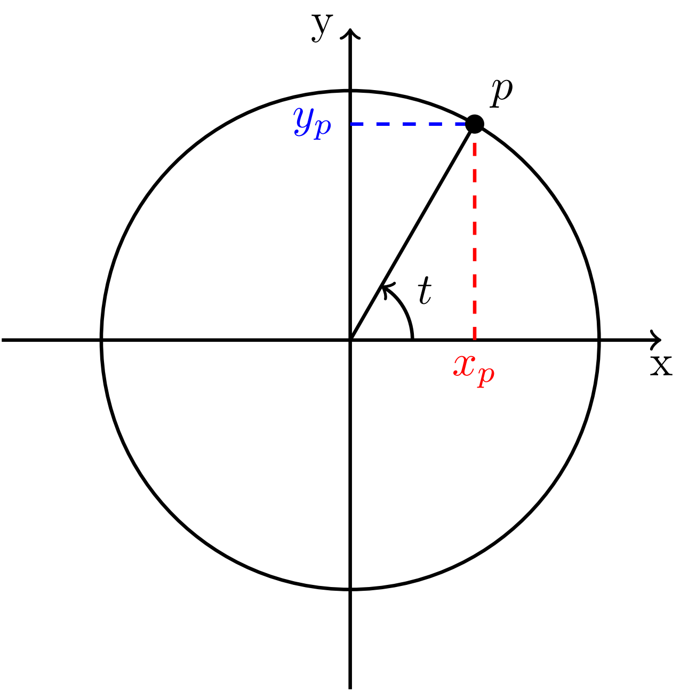

# Pengenalan Kepada Fungsi Gelombang

Pada tahun 1933, Erwin R. J. A. Schr&ouml;dinger berkongsi Hadiah Nobel bidang Fizik bersama Paul A. M. Dirac atas "penemuan bentuk-bentuk produktif yang baharu dalam teori keatoman." Beliau berjaya membina satu persamaan yang menerangkan sistem-sistem kuantum dengan tepat. Persamaan itu dinamakan persamaan Schr&ouml;dinger dan akar persamaan ini ialah fungsi gelombang. Maka dalam bab itu, kita akan mengenali sifat-sifat fungsi gelombang sebelum boleh meneroka persamaan Schr&ouml;dinger. Khususnya, bab ini akan menerangkan perkaitan fungsi eksponen dengan bentuk gelombang.


## Bulatan unit: fungsi trigonometri

Apa itu gelombang? Bagi tujuan bab ini, cukuplah kita takrifkan gelombang sebagai suatu lengkung yang naik dan turun secara berkala. Bentuk gelombang yang unggul diberikan nama gelombang sinus kerana ia diperihalkan oleh fungsi sinus dan kosinus.

Bagi membina jambatan dari fungsi sinus ke fungsi eksponen, kita perlu melihatnya dari sudut pandang geometri. Khususnya, kita akan mengenali makna sinus dan kosinus dalam bulatan unit.

Perkataan 'unit' dalam istilah 'bulatan unit' merujuk kepada nilai 'satu'. Bulatan unit merujuk kepada sejenis bulatan yang mempunyai jejari satu yang dilukis pada satah Kartes. Boleh sahaja kita pilih mana-mana jejari lain tetapi jejari satu ditetapkan sebagai rujukan. 

Sememangnya, nilai satu digunakan sebagai rujukan untuk mana-mana ukuran pun. Misalnya, ukuran panjang pada pembaris ditandakan setiap kali tiba kepanjangan 'satu' meter atau 'satu' sentimeter, dsb. Hal ini yang melayakkan ia memegang nama 'unit'.

```{r fg-bulat-unit, echo=FALSE, fig.align='center',out.width='300px', fig.cap="Bulatan unit ialah bulatan berjejari 1."}

```
Terdapat dua kaedah untuk memerihalkan kedudukan setiap titik pada ukurlilit bulatan unit ini. Disebabkan bulatan ini dibentangkan pada satah Kartes, maka pastinya titik-titik itu boleh diperihalkan menggunakan koordinat Kartes $x_p$ dan $y_p$. Itulah kaedah pertamanya.

Kaedah keduanya ialah dengan menggunakan sudut $t$ yang memisahkan arah titik $p$ dengan arah positif paksi--$x$. Disebabkan titik-titik ini hanya berada pada garis ukurlilit itu sahaja, maka setiap sudut $t$ hanya akan dipasangkan pada satu satu titik $p$. Tidak ada titik lain yang akan berkongsi sudut tersebut.

Sebetulnya, untuk titik sembarangan pada satah Kartes, kaedah sudutan ini perlu dipasangkan dengan jaraknya dari asalan bagi membezakan titik yang berhampiran daripada titik yang berjauhan. Namun, disebabkan semua titik $p$ pada ukurlilit bulatan mempunyai jarak yang sama dari asalan, maka parameter jarak ini boleh diabaikan.

Disebabkan kedua-dua kaedah ini merujuk kepada perkara yang sama, wujudnya satu kesepadanan yang memadankan kaedah sudutan dengan kaedah koordinat Kartes. Dalam erti kata lain, terdapat sepasang fungsi yang boleh menterjemahkan sudut $t$ menjadi sesaran $x_p$ dan sesaran $y_p$,
$$f(t) = x_p,\;g(t) = y_p.$$

(Graf di sini: "Graf yang dihasilkan oleh fungsi $f(t)$ dan $g(t)$ terhadap $t$. Graf ini membentuk graf sinus.")

Graf yang dihasilkan kedua-dua fungsi ini ialah gelombang sinus tulen. 

## Sifat fungsi trigonometri